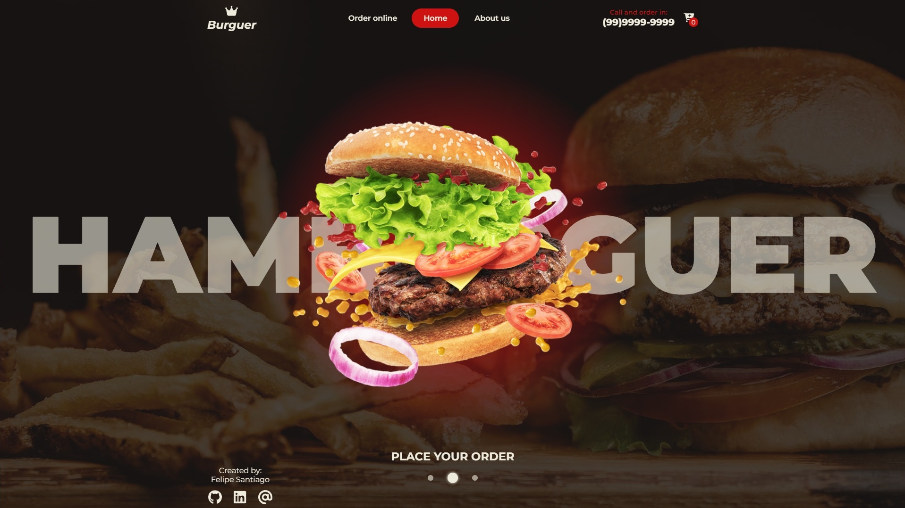
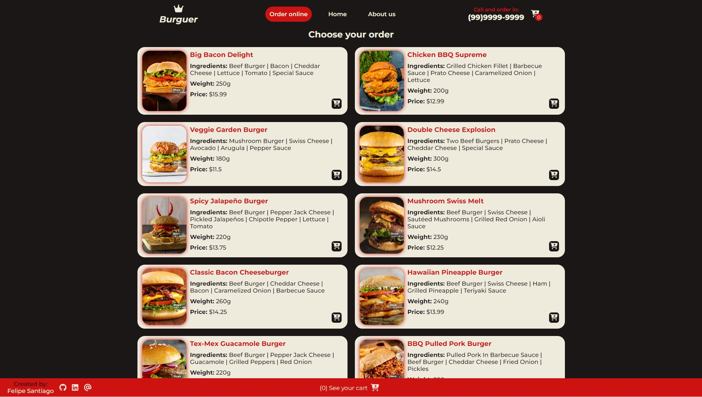
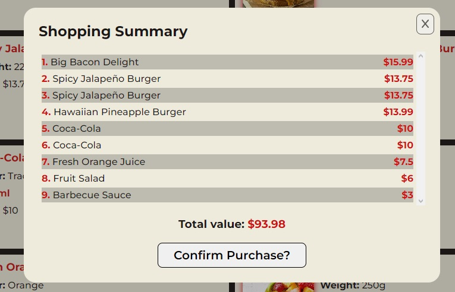

# Hamburger Shop using TypeScript

🧾✍ This is a personal project using React + Vite + TypeScript.

[Click here to view the project in your web browser](https://hamburger-shop.vercel.app).



## Summary

- [General Vision](#general-vision)
  - [Objective](#objective)
  - [Screenshots](#screenshots)
- [My Process](#my-process)
  - [Technologies Used](#technologies-used)
  - [Project Functionality](#project-functionality)
  - [How to Run the Project](#how-to-run-the-project)
  - [Continuous Development](#continuous-development)
  - [Thanks](#thanks)
  - [Useful Resources](#useful-resources)
- [Author](#author)

## General Vision

### Objective

- Create a hamburger shop with home, shop, about, and cart pages:
    - Home: Introduce the user to the shop
    - Shop: Create a list of snack cards that can be added to the shopping cart
    - About: An "about us" page where the user can see the establishment address and learn more about the service and the team
    - Cart: Final page where the user can conclude their order, view the snacks added to the cart, remove any if necessary, and see the total shopping value.

### Screenshots

#### Functionality


#### Responsivity


## My Process

### Technologies Used

- [React](https://react.dev)
- [Styled-Components](https://styled-components.com)
- [Context-API](https://legacy.reactjs.org/docs/context.html)
- [LocalStorage](https://developer.mozilla.org/en-US/docs/Web/API/Window/localStorage)
- [React-router-dom](https://reactrouter.com/en/main)
- [Typescript](https://www.typescriptlang.org)
- [Font-awesome-icons](https://fontawesome.com)

### Project Functionality

First, we created the home page, which doesn't have complex code. Only styled code was used to align the images.
A cart icon was created that updates its value when a new product is added.
There are other fields that allow the user to see how many items he has chosen. So, a context was used to store snack information from the shopping to be used and shown on the cart page.

```tsx
export const CartProvider: React.FC<ICartProviderProps> = ({children}) => {
    const [cartItems, setCartItems] = useState<ISnackData[]>(() => {
        const localCartData = localStorage.getItem('cartData');
        return localCartData ? JSON.parse(localCartData) : [];
    });

    useEffect(() => {
        window.localStorage.setItem('cartData', JSON.stringify(cartItems));
    }, [cartItems])

    return (
        <CartContext.Provider value={{cartItems, setCartItems}}>
            {children}
        </CartContext.Provider>
    )
}
```

Here we collect the ID, name, flavor, price, and other information from the chosen snack.

```tsx
export interface ISnackData {
    id: number;
    name: string;
    flavor?: string;
    ml?: number;
    price: number;
    image: string;
    ingredients?: string[];
    weight?: string;
}
```

To collect that data, a JSON file was created to contain this information and be accessed later.

```json
{
    "data": [
        {
            "id": 1,
            "name": "Big Bacon Delight",
            "ingredients": [
                "ingredients list"
            ],
            "price": 15.99,
            "image": "image-url",
            "weight": "250g"
        },
    ]
}
```

That way, the JSON data was stored in a state using useState, and for each snack, using the ```.map``` method, a Card component is rendered on the screen. Inside the component, we transfer the JSON data using a prop, which is then used to render the snack information.

```tsx
{snackData.flavor &&
    <p className="flavor">
        <span>Flavor:</span> {snackData.flavor}
    </p>
}
{snackData.weight &&
    <p className="weight">
        <span>Weight:</span> {snackData.weight}
    </p>
}
<div className="price">
    {snackData.price &&
        <p className="price">
            <span>Price: </span> ${snackData.price}
        </p>
    }
    {snackData.ml &&
        <p className="price">
            <span className="mlMeasure">- {snacml}ml</span>
        </p>
    }
</div>
```
At this point, that is the result:



Now, the focus is on adding the user options to his cart. When the user clicks on the cart button in any of the snack cards, it opens a new card to confirm the order and select how many of that snack will be added to the cart. After confirming the order, the snack details will be added to the **cartItems** context to be used in the cart.

If ```cartItems.length > 0```, the items will be shown on the screen. Otherwise, a message will advise the user that his cart is empty.

At the bottom of the page, it's possible to see the final price of the purchase. This sum was made using the ``reduce`` method to sum the price of every snack added to the cartItems state.

```tsx
    useEffect(() => {
        setTotalValue(0);
        const total = cartItems.reduce((acc, snack) => acc + snack.price, 0);
        setTotalValue(Number(total.toFixed(2)));
    }, [cartItems])
```

Every time that **cartItems** is changed, as when the user deletes an item inside the cart, the **useEffect** is called again, setting the **totalValue** state to zero again, to remake the sum.

Finally, at the bottom of the cart page, it's possible to conclude the purchase using the "finalize purchase" button. When this button is clicked, a shopping summary is shown, with the name of all items, their values, and the total value of the purchase. Then, the user can confirm their purchase.

```tsx
{cartItems.length > 0
    ? <>
        <h2 className="summaryTitle">Shopping Summary</h2>
        <ul className="items">
            {cartItems.map((item, index) =>
                <li key={index} className="item"><p className="name"><span>{index + 1}.</span> {item.name}</p><span>${item.price}</span></li>
            )}
        </ul>
        <h3 className="totalValue">Total value: <span>${totalValue}</span></h3>
        <button className="finalizePurchase" onClick={handleCompletePurchase}>Confirm Purchase?</button>
    </>
    : <div className="thankYou">
        <h2>Thank you for your choice!</h2>
        <p>Your delicious snacks will arrive really soon, enjoy! 🍔😋</p>
    </div>
}
```



### How to execute the project
- The project was created with [React-Vite](https://vitejs.dev).

- To download the project, open the terminal in the VSCode and write the dependencies code installations: **npm install**

The package.json file already contains the version of the library in its data, so all the libraries used in this project will be installed on your machine in the same way. But if you are interested in how to download, use, or learn more about the libraries and APIs that were used in my code, as well as the localStorage, access the links in the [Usefull resources](#usefull-resources).

- To run the project in the browser, it is necessary to activate **NPM Scripts** in the three dots next to the EXPOLORER of VSCode.


- Then, in the bottom-left window of **NPM SCRIPTS**, click on the **run** button next to package.json/dev vite.


- Finally, in the terminal, keep the **localhost** link will appear where the project will be running in your browser. Hover over it and click **Follow link**, or press the ctrl button on your keyboard and click on the **localhost**, and the page will open in your default browser.


There are other ways to open the project, but that form it is the one that I'm used to use.


### Continuous development

This project was made to improve my [Typescript](https://www.typescriptlang.org) knowledge and to get familiar with it. Everything I know is only possible today thanks to the entire team of teachers at [DevQuest](https://www.linkedin.com/school/devquest-dev-em-dobro/), that guide me to be a frontend developer. I hope to put in practice my knowledge to improve the users life with some way.

### Recursos úteis

- [Styled-Components](https://styled-components.com): Utilising tagged template literals (a recent addition to JavaScript) and the power of CSS, styled-components allows you to write actual CSS code to style your components. It also removes the mapping between components and styles – using components as a low-level styling construct could not be easier!

- [Context-API](https://legacy.reactjs.org/docs/context.html): Context provides a way to pass data through the component tree without having to pass props down manually at every level.

- [LocalStorage](https://developer.mozilla.org/en-US/docs/Web/API/Window/localStorage): The localStorage read-only property of the window interface allows you to access a Storage object for the Document's origin; the stored data is saved across browser sessions.

- [React-router-dom](https://reactrouter.com/en/main): React Router allows "client-side routing". Pages load faster, improving the end user experience.

- [TypeScript](https://www.typescriptlang.org): TypeScript enhances JavaScript development with static typing, improved tooling, and better code readability, leading to more robust and maintainable applications.

## Autor

- GitHub - [Felipe Santiago Morais](https://github.com/SantiagoMorais)
- Linkedin - [Felipe Santiago](https://www.linkedin.com/in/felipe-santiago-873025288/)
- Instagram - [@felipe.santiago.morais](https://www.instagram.com/felipe.santiago.morais)
- Email - <a src="mailto:contatofelipesantiago@gmail.com" target="blank">contatofelipesantiago@gmail.com</a>
